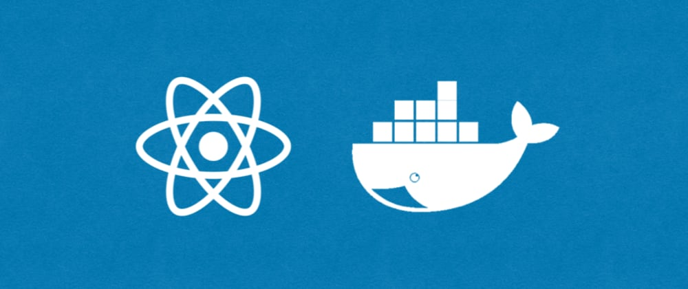

 

> A dockerized MERN Project

# MERN-Docker App

This project has been built with the MERN Stack and it can run on docker. It is a basic CRUD.

## Usage
Install Docker from [here](https://www.docker.com/get-started). Make sure it is working correctly.

Clone or pull this repository, open a terminal in the directory, and run the following command:
### `docker-compose up --build`
This will create the container with two images, the Mongo image and the Express image, React client is included in the latter.

All 3 parts of the app are connected with a network bridge within the docker container.

## Endpoints of the Express API

Server is running on port 8080.

`/tasks` - This endpoint will response with every task object from MongoDB.

`/insert` - This endpoint will add a new task to the DB.

`/delete/:id` - This endpoint will delete the selected task.

`/update` - This endpoint will update the selected task.